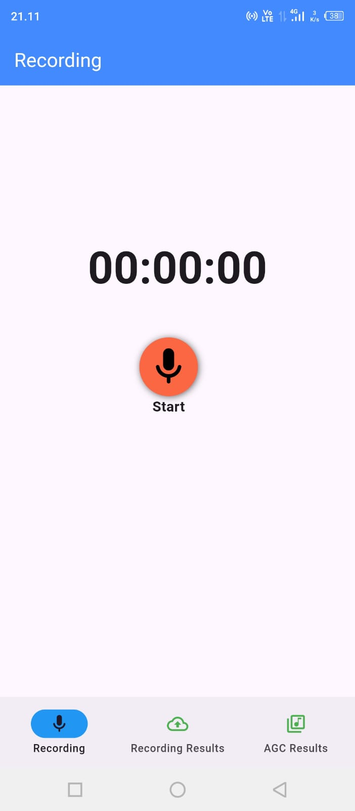
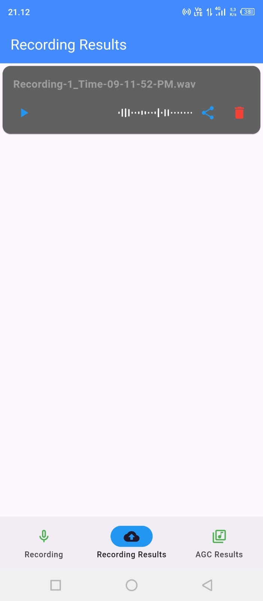
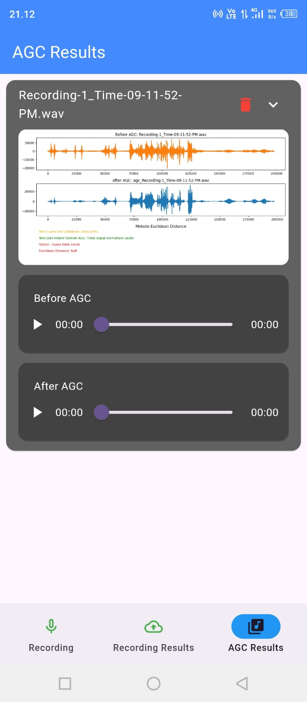
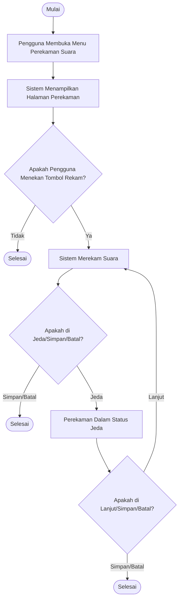
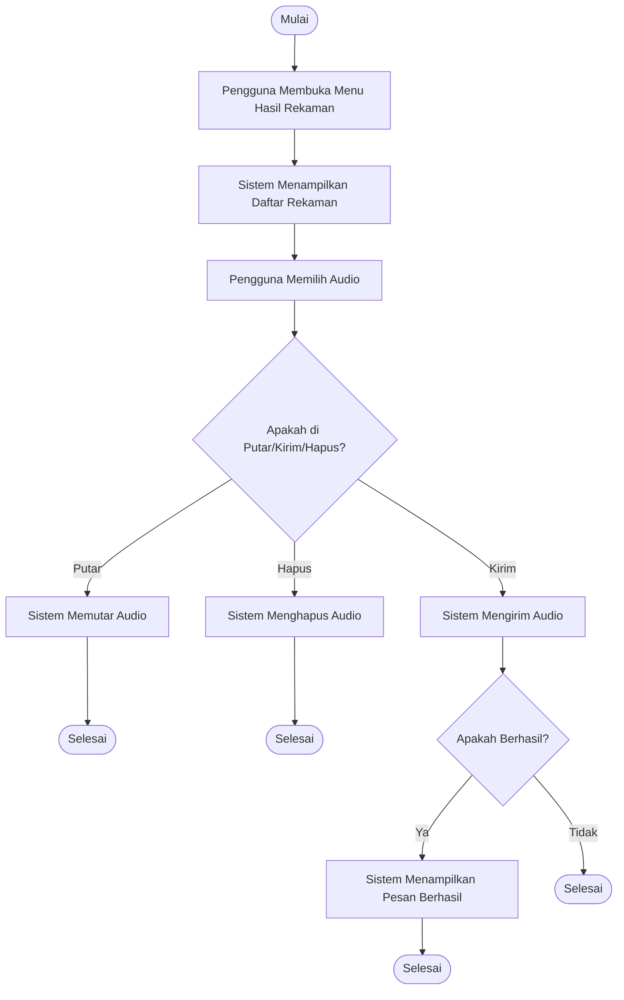
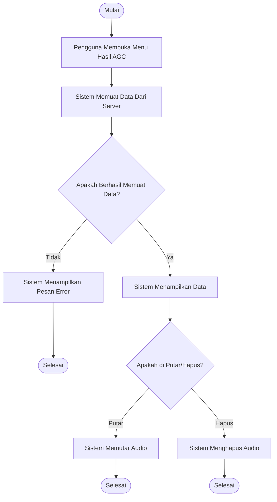

# AGC Record
Aplikasi Perekaman Suara, menggunakan algoritma Automatic Gain Control sebagai pemrosesan audio yang diterapkan di cloud server.

|No|Nama|Dokumentasi|
|--|--|---|
|1|Flutter|<a  href="https://docs.flutter.dev/" target="_blank">Lihat</a>|
|2|Dart|<a  href="https://dart.dev/docs"  target="_blank">Lihat</a>|

## 🗂️ Struktur Folder Utama
```
project_root/
├── assets/
│   ├── animation/
│   └── images/                    
│       ├── logo_agc_record.png       # Gambar Logo Aplikasi
│       ├── logo_agc_record-2.png     # ...
│       └── logo_agc_record-3.png     # ...
├── lib/
│   ├── pages/
│   │   ├── agc_result.dart           # Tampilan Menu Hasil Pemrosesan Audio
│   │   ├── fade_page_route.dart      # Mengatur Perpindahan Halaman
│   │   ├── recording_result.dart     # Tampilan Menu Hasil Rekaman
│   │   └── recording.dart            # Tampilan Menu Rekaman
│   ├── widgets/
│   │   └── bottom_nav.dart           # Menu Navigasi
│   ├── main.dart                     # App entry point
│   └── splash_screen.dart            # Loading aplikasi
├── README.md                         # Dokumentasi proyek ini
└── ...
```
## Fitur Utama
 1. Perekaman Suara
 2. Pengriman Suara Audio Menuju Cloud Server
 4. Hasil Pengelolaan Audio
## Tampilan Aplikasi
<div style="display: flex; justify-content: center; gap: 50px;">
  
  
  
</div>
Untuk Menampilkan Hasil Audio Secara Detail dapat mengakses <a  href="https://agcrecord.batutech.cloud/"  target="_blank">Hasil Pemrosesan Audio</a>

## 🔁Alur Fungsional Menu

> Diagram berikut menjelaskan alur pengguna dalam mengakses, memutar,
> menghapus, atau mengirim hasil rekaman.

 1. Menu perekaman Suara

2. Hasil Rekaman

 3. Hasil Pengelolaan AGC

## Requirements
 -  Flutter (version 3.19.0 or higher)
-   Dart (version 3.3.0 or higher)
-   Android Studio / VS Code
-   Android SDK (for Android deployment)
-   Xcode (for iOS deployment)
## 🛠️ Langkah-langkah Inisialisasi Proyek
### 1. Clone Repositori
```bash
git  clone  https://github.com/GregoriusValentine/agc_record.git
cd agc_record
```
### 2. Install Dependencies
```bash
flutter pub get
```
### 3. Jalankan Aplikasi
```bash
flutter run
```
Untuk perangkat tertentu:
```bash
flutter run -d chrome       # Untuk web
flutter run -d macos        # Untuk macOS
flutter run -d <device-id>  # Untuk Perangkat Spesifik
```
### 4. Untuk Produksi
Android
```bash
flutter build apk --release
# Atau
flutter build appbundle --release
```
iOS
```bash
flutter build ios --release
```
Lalu arsipkan dan unggah menggunakan Xcode.
### 🫱🏼‍🫲🏼5. Berkontribusi
Alur Kerja
```bash
# Fork repository melalui GitHub UI

# Clone fork Anda
git clone https://github.com/GregoriusValentine/agc_record.git
cd agc_record

# Tambahkan remote upstream
git remote add upstream https://github.com/GregoriusValentine/agc_record.git

# Buat branch fitur baru
git checkout -b [nama_branch_fitur]

# Buat perubahan kode menggunakan editor Anda
# Tambahkan perubahan dan commit
git add .
git commit -m 'Add user authentication screens and logic' #sesuaikan

# Sinkronkan dengan upstream sebelum push
git fetch upstream
git rebase upstream/main

# Push ke GitHub
git push -u origin [nama_branch_fitur]

# Buat Pull Request melalui GitHub UI
```


## 📄 Lisensi
> Proyek ini merupakan bagian dari Tugas Akhir dan tidak digunakan untuk
> tujuan komersial. Anda bebas memodifikasi dan mengembangkan ulang
> dengan menyertakan atribusi.
